# Execution Flow Map

Last reviewed: 2026-08-31

This document is the runtime integration map for the reporting automation. Update it whenever an entry point, module handoff, shared state, external dependency, concurrency rule, error path, or exit-code contract changes. During troubleshooting, start with the applicable trace path below and verify each boundary in order.

## System Overview

The system is a scheduled, file-oriented automation rather than a web application. Windows Task Scheduler starts PowerShell or Python processes. The primary runner selects a batch, copies its master workbook from a network share to a local temporary folder, and reads the workbook's report list. It then fans the reports out to isolated PowerShell worker processes.

Each refresh worker obtains a machine-wide Excel slot, creates a hidden Excel COM instance, refreshes the workbook's Power Query connections, tables, pivots, and data model, saves the workbook, and shuts down only the Excel process it owns. Refresh and skip results are written to the MySQL `events` table. A concurrency-safe per-run trace records each dispatch, worker, workbook, Excel, cleanup, and database phase so an interrupted run still shows the active file and last phase reached.

After refresh processing, the runner exports the batch's database events to CSV. Configured batches then read a separate email-list workbook and send eligible report attachments through Google Workspace SMTP Relay. Batch 8 instead triggers an FTP synchronization step. Separate scheduled maintenance scripts clean the Power Query cache and copy/archive log files.

```mermaid
flowchart LR
    TS[Windows Task Scheduler] --> SR[Scheduled-Runner.ps1]
    SR --> MW[Batch master workbook on SMB share]
    MW --> LC[Local master copy]
    LC --> RP[Run-Parallel.ps1]
    RP --> GM[Get-PathsFromMaster]
    GM --> WL[Work items: Path, Method, Row]
    WL --> DBQ[(MySQL events skip check)]
    DBQ -->|already OK| SKIP[Write Refresh/SKIP]
    DBQ -->|not OK or DB check fails| RO[Refresh-One.ps1 workers]
    RO --> MX[Machine-wide Excel mutex slots]
    RO --> TRACE[Per-run refresh phase trace]
    MX --> EX[Owned Excel COM instance]
    EX --> RF[Refresh, calculate, save report]
    RF --> DBR[(Write Refresh OK/FAIL)]
    DBR --> CSV[Export refresh CSV]
    CSV --> EMAIL[send_reports_configured.py]
    EMAIL --> DBE[(Validate and write Email events)]
    EMAIL --> SMTP[Google Workspace SMTP Relay]
    CSV -->|Batch 8| FTP[network_to_ftp_sync_ACTIVE.py]
```

### Runtime boundaries and sources of truth

| Concern | Current source of truth | Runtime dependency |
| --- | --- | --- |
| Scheduled times and task actions | Windows Task Scheduler | Not fully represented in the repository |
| Batch number to master workbook | `$MasterFileMap` in `Scripts/Scheduled-Runner.ps1` | SMB share and local Batch 7 test file |
| Batch label stored with refresh events | `$BatchNameMap` in `Scripts/Scheduled-Runner.ps1` | Passed through all refresh processes |
| Per-batch worker count | `$BatchThrottleMap` in `Scripts/Scheduled-Runner.ps1` | Batch 1 = 3; Batches 2-9 = 2; missing entry = 2 |
| Machine-wide Excel capacity | `MachineExcelLimit` parameter | Three named mutex slots by default |
| Report worklist | Master workbook rows | Column B = report path, E = optional override path, F = method |
| Refresh and email history | MySQL `events` table | Connection comes from `REPORTLOGS_CONN` or `-DbConn` |
| In-progress refresh diagnosis | `Logginfo\refresh-trace_YYYY-MM-DD_Batch-N.log` | `Shared-Trace-Helpers.ps1` serializes writes from all dispatchers and workers |
| Email recipients and attachments | Batch email-list workbook, sheet `List` | Configured by `$EmailListMap` |
| SMTP behavior | `CONFIG` in `Scripts/send_reports_configured.py` | Google Workspace SMTP Relay over STARTTLS |
| FTP behavior | `CONFIG` in `Scripts/network_to_ftp_sync_ACTIVE.py` | Network source folder and external FTP server |
| Operational logs | `Logginfo`, `logs`, and `C:\ProgramData\ReportRunner\logs` | Local filesystem plus optional network archive |

The repository is currently reviewed under `D:\Data\Project-Reporting-Automation`, while the primary scripts contain live defaults under `C:\Users\kapl\Desktop\Project-Reporting-Automation`. Deployment from the repository to that live location is therefore a separate handoff.

## Core Flows / Trace Paths

### Flow 1 - Scheduled batch orchestration

#### Entry Point

Windows Task Scheduler is expected to invoke PowerShell 7 with `Scripts/Scheduled-Runner.ps1 -BatchNumbers "N"`. The task process must have access to the SMB shares and the `REPORTLOGS_CONN` environment variable unless `-DbConn` is passed explicitly.

The supplied Task Scheduler snapshot identifies daily report tasks for Batches 1, 2, 3, 4, 5, 6, 8, and 9. The complete task definitions are not stored in the repository and were not present on the machine used for this review, so their exact actions and triggers cannot be verified from code alone.

The task names and the batch labels written by the code currently line up as follows. Task-name times are descriptive labels from the supplied scheduler output, not verified trigger definitions:

| Batch | Supplied task name | `$BatchNameMap` value written to Refresh events |
| --- | --- | --- |
| 1 | `Run_Daily_Report_Batch_1_11PM` | `00:05` |
| 2 | `Run_Daily_Report_Batch_2_6AM` | `05:00` |
| 3 | `Run_Daily_Report_Batch_3_11AM` | `11:00` |
| 4 | `Run_Daily_Report_Batch_4_12PM` | `12:00` |
| 5 | `Run_Daily_Report_Batch_5_1PM` | `13:30` |
| 6 | `Run_Daily_Report_Batch_6_2PM` | `14:00` |
| 8 | `Run_Daily_Report_Batch_8_6PM` | `18.20` |
| 9 | `Run_Daily_Report_Batch_9_10AM` | `10.00` |

The differences for Batches 1, 2, 5, and 8 should be checked against the production triggers before treating either label as the actual start time.

#### Step-by-Step Path

1. `Scripts/Scheduled-Runner.ps1` validates the database connection string before starting any batch.
2. It loads `$MasterFileMap`, `$BatchNameMap`, `$BatchThrottleMap`, and `$EmailListMap`.
3. It parses comma-separated `BatchNumbers` into integers and creates the log and temporary directories.
4. It loads `MySql.Data` from the installed assembly or a fallback DLL path.
5. For each requested batch, sequentially:
   1. Unknown batch numbers are logged and skipped.
   2. `Get-RunId` creates `run-log_YYYY-MM-DD_Batch-N`. Batches 1 and 2 use the next date when invoked at or after 18:00. The runner derives the matching `refresh-trace_YYYY-MM-DD_Batch-N.log` path.
   3. The selected master workbook is copied to `C:\Temp\ExcelAutomation`.
   4. The batch throttle is read from `$BatchThrottleMap`; a missing entry uses two workers.
   5. The runner calls `Scripts/Run-Parallel.ps1` in-process and passes the local master path, batch label, run ID, trace path, database connection, fast-mode flag, batch throttle, and machine-wide Excel limit.
   6. When `Run-Parallel.ps1` returns, `Export-RunLogCsv` queries MySQL by refresh `run_id` and writes `Logginfo\run-log_YYYY-MM-DD_Batch-N.csv`.
   7. After a ten-second delay, a configured email batch starts `Scripts/send_reports_configured.py` as a child Python process and waits for it to finish.
   8. Batch 8 starts `Scripts/network_to_ftp_sync_ACTIVE.py` after refresh export.
   9. The local master copy is deleted in the batch `finally` block.
6. The runner logs an OK/FAIL batch summary and returns zero only when its internal `$failed` count is zero.

#### State Changes

- Creates and removes a local master-workbook copy.
- Appends orchestration messages to `Logginfo\scheduled-runner.log`.
- Appends detailed concurrent refresh phases to `Logginfo\refresh-trace_YYYY-MM-DD_Batch-N.log`.
- Passes a logical `run_id`, logical refresh date, batch label, concurrency settings, and database connection to downstream scripts.
- Causes downstream refresh/email rows to be inserted into MySQL and exported to CSV.
- Sends email or uploads FTP files for configured batches.

#### Exit Point

`Scheduled-Runner.ps1` exits `0` when no batch-level exception reached its outer `catch`; otherwise it exits `1`. Some downstream failures are currently logged but do not increment the batch failure count; see "Flow 7 - Error handling and status propagation."

### Flow 2 - Master worklist extraction and parallel dispatch

#### Entry Point

`Scripts/Scheduled-Runner.ps1` calls `Scripts/Run-Parallel.ps1`. Direct invocation is also possible through older batch/launcher files, but those routes do not contain the complete current scheduler configuration.

#### Step-by-Step Path

1. `Run-Parallel.ps1` dot-sources `Scripts/Shared-Excel-Helpers.ps1` and `Scripts/Shared-Trace-Helpers.ps1`, then resolves `Scripts/Refresh-One.ps1` relative to its own folder.
2. It loads `MySql.Data`, validates the connection string, derives the logical run date from `LogIdentifier`, and prepares an 18-hour fallback cutoff. The active skip logic uses the logical run date; the calculated accepted-date list and cutoff are not currently consumed.
3. It writes `BATCH_START` and `WORKLIST_READ_START`, calls `Get-PathsFromMaster` in `Shared-Excel-Helpers.ps1`, then writes `WORKLIST_READ_END` with the item count.
4. `Get-PathsFromMaster`:
   1. Obtains a machine-wide Excel slot through `Start-Excel`.
   2. Opens the local master workbook read-only.
   3. Uses the first worksheet unless `SheetName` is supplied.
   4. Reads rows from `StartRow` to the last populated path row.
   5. Selects column E as the final path when present; otherwise it uses column B. Column F becomes `Method`.
   6. Returns objects shaped as `{ Path, Method, Row }`, closes the master, and releases its Excel instance and slot.
5. `ForEach-Object -Parallel` processes the work items with the selected per-batch `ThrottleLimit`.
6. For each item, the parallel runspace writes `ITEM_RECEIVED` with the master row and method, then brackets the MySQL skip query with `DB_SKIP_CHECK_START` and `DB_SKIP_CHECK_END` or `DB_SKIP_CHECK_ERROR`.
7. If the query succeeds and finds an existing OK event, `Write-SkipRowToDb` inserts a `Refresh/SKIP` event. The trace records `ITEM_SKIP_START` and `ITEM_SKIP_END` or `ITEM_SKIP_LOG_ERROR`.
8. If no OK event exists, or the skip-check database query fails, the runspace writes `WORKER_LAUNCH`, starts a separate PowerShell 7 process for `Refresh-One.ps1`, and passes the report path, trace path, and all run metadata. The database connection is passed to the child but is never written to the trace.
9. When a child returns, the dispatcher writes `WORKER_EXIT` with its exit code. The pipeline waits until all items return and then writes `BATCH_DISPATCH_COMPLETE`.

#### State Changes

- The master workbook is read but not modified.
- Each source row becomes an in-memory work item.
- Every work item has durable dispatcher records containing its report path, master row, method, worker process ID, and dispatch status.
- Existing successful work produces a new `Refresh/SKIP` database event.
- A database failure during the skip check deliberately changes behavior to "process the file" so a database outage cannot incorrectly suppress a refresh.
- The batch throttle limits active runspaces; the separate named mutex gate limits combined Excel instances across all batches.

#### Exit Point

Control returns to `Scheduled-Runner.ps1` after every work item finishes. `Run-Parallel.ps1` currently does not aggregate child `Refresh-One.ps1` exit codes into its own exit status.

### Flow 3 - Machine-wide Excel slot and owned-process lifecycle

#### Entry Point

`Start-Excel` in `Scripts/Shared-Excel-Helpers.ps1` is called while reading a master workbook and once per refresh attempt.

#### Step-by-Step Path

1. `Enter-ExcelConcurrencySlot` opens named mutexes `Global\ProjectReportingAutomation.ExcelRefresh.Slot1` through `SlotN`.
2. `WaitAny` waits up to `ExcelSlotWaitTimeoutSec` for one slot. An abandoned mutex is treated as acquired so work can recover after a worker dies.
3. `Start-Excel` traces slot wait/acquisition and creates a hidden `Excel.Application` COM object.
4. `Get-ExcelProcessId` maps `Excel.Application.Hwnd` to the owning operating-system PID.
5. The helper records both PID and mutex slot using the COM object's runtime hash as its instance key.
6. Excel alerts, screen updates, status bar, and events are disabled; calculation is set to manual.
7. The caller uses that Excel instance.
8. `Stop-Excel` resolves the recorded PID and slot, traces quit and COM-release boundaries, calls `Excel.Quit()`, releases the COM object, and forces garbage collection.
9. It waits up to five seconds for the owned PID to exit. If it remains alive, only that PID is force-terminated.
10. It removes the ownership records and traces release/disposal of the named mutex. If shutdown stalls, the last trace phase distinguishes quit, COM release, process-exit wait, targeted force-kill, and slot release.

#### State Changes

- Acquires and releases one machine-wide concurrency slot.
- Adds and removes entries in the process-local `$script:OwnedExcelProcessIds` and `$script:OwnedExcelSlots` maps.
- Creates and terminates only the Excel process owned by the caller.
- Does not enumerate or bulk-terminate unrelated Excel processes.

#### Exit Point

`Start-Excel` returns an Excel COM object to its caller. `Stop-Excel` returns after normal shutdown or targeted force-kill and slot release. Failure during Excel creation releases the slot before rethrowing.

### Flow 4 - Single workbook refresh

#### Entry Point

A `Run-Parallel.ps1` runspace starts a new PowerShell 7 process with `Scripts/Refresh-One.ps1 -Path <report> ...`.

#### Step-by-Step Path

1. `Refresh-One.ps1` dot-sources `Shared-Trace-Helpers.ps1` and `Shared-Excel-Helpers.ps1`, writes `PROCESS_START`, then traces MySQL assembly loading and input validation.
2. It creates a unique `C:\Temp\ExcelTmp\<safe-file-name>_<guid>` folder and sets process-scoped `TEMP` and `TMP` to that folder.
3. It writes `ATTEMPT_START`, registers the COM message filter, and calls `Start-Excel`, which may wait for a global slot. The trace associates the report path with both the PowerShell worker PID and owned Excel PID.
4. It calls `Invoke-ComRetry { Refresh-WorkbookSmart ... }`. COM busy and RPC-unavailable HRESULTs use bounded exponential retry inside this wrapper.
5. `Refresh-WorkbookSmart`:
   1. Traces path validation and `WORKBOOK_OPEN_START/END`, then opens the target workbook read/write.
   2. Outside Fast Mode, traces connection configuration and disables background query for ODBC/OLE DB connections where possible.
   3. Brackets `Workbook.RefreshAll()` and `Excel.CalculateUntilAsyncQueriesDone()` with durable start/end/error phases.
   4. Brackets `Wait-Connections` with `CONNECTION_WAIT_START` and either `CONNECTION_WAIT_END` or `CONNECTION_WAIT_TIMEOUT`; while connections still report refreshing, it emits `CONNECTION_WAIT_PROGRESS` every 60 seconds. The timeout is observational in this change and preserves the existing continue-to-save behavior.
   5. Outside Fast Mode, traces table/Pivot discovery and each query-table or Pivot refresh by worksheet and object name.
   6. Traces data-model refresh, full calculation, and `SAVE_START/END`.
   7. Traces `WORKBOOK_CLOSE_START/END/ERROR` in `finally`.
6. If the failure refers to Office cache paths, the worker stops Excel, clears Office cache folders, and retries once.
7. If the failure is RPC server unavailable, the worker stops Excel, rebuilds Excel, and retries once.
8. Any other refresh exception sets `status=FAIL` and captures its message.
9. The attempt `finally` block stops the owned Excel instance and unregisters the COM message filter.
10. `Write-EventToDb` inserts one `events` row with stage `Refresh`, status `OK` or `FAIL`, duration, report path, master path, method, batch label, run ID, and logical date. `DB_EVENT_WRITE_START/END/ERROR` and `PROCESS_END` remain in the file trace even if the MySQL write fails.

#### State Changes

- The target report workbook is refreshed and saved in place.
- A per-worker temporary directory is created and becomes that process's `TEMP`/`TMP` location.
- Office caches may be deleted only on the targeted cache-collision retry path.
- One refresh result is normally inserted into the MySQL `events` table.
- One append-only trace file receives phase records containing timestamp, level, source, run ID, batch, worker PID, Excel PID, phase, elapsed seconds, report path, and sanitized details. Database credentials are excluded.
- The Excel mutex slot and owned PID are released during cleanup.

#### Exit Point

The worker exits `0` for refresh status OK and `1` for refresh status FAIL. If DB insertion fails after a successful refresh, it logs a warning but still exits `0`. Failures before the refresh-status block can terminate without inserting an event.

### Flow 5 - Email report dispatch

#### Entry Point

For batches present in `$EmailListMap`, `Scheduled-Runner.ps1` starts `Scripts/send_reports_configured.py --batch N --email-list <path>` and synchronously waits for it. Current email mappings exist for Batches 1, 2, 3, 4, 5, 6, and 9.

#### Step-by-Step Path

1. `main()` parses arguments. Unless `--email-date` is passed, the email logical date is the machine's current local date.
2. `load_email_list` uses pandas to read the `List` worksheet and validates required columns: `Receiver`, `CC`, `BCC`, `Subject`, and `Attachement Path`.
3. It creates an `email-log_YYYY-MM-DD_Batch-N` run ID and starts a `ThreadPoolExecutor`, using three workers by default.
4. Each `process_single_email` worker opens its own MySQL connection and normalizes recipients, subject, and semicolon-separated attachment paths.
5. Unless force-resend is active, every attachment must:
   1. Exist on disk or the network share.
   2. Have a latest `Refresh/OK` event whose date equals the email run date.
   3. Optionally have refresh method `Email` when `REQUIRE_METHOD_EMAIL` is enabled.
6. `db_already_emailed_ok` suppresses a duplicate with matching date, email batch label, recipient, subject, attachment key, and configured fallback window. The worker writes `Email/SKIP`.
7. The worker rejects attachment sets above the configured raw-size safety threshold, then reads the files and builds text/HTML MIME content.
8. `send_via_google_relay` obtains the SMTP connection assigned to that thread. Cached connections are recycled by age/message count and checked with `NOOP` before reuse.
9. The SMTP client uses STARTTLS and IP-based relay authorization. Temporary SMTP/network errors close the broken socket and retry with bounded exponential backoff; permanent errors return immediately.
10. The worker writes an `Email/OK`, `Email/FAIL`, or `Email/SKIP` event and returns timing/size metrics.
11. `main()` aggregates results as futures complete, closes all remaining SMTP sockets, exports the email run from MySQL to `Logginfo\email-log_YYYY-MM-DD_Batch-N.csv`, and logs a summary.

#### State Changes

- Reads but does not modify the email-list workbook or attachments.
- Creates concurrent database connections and thread-local reusable SMTP connections.
- Sends messages to the configured recipients.
- Inserts one Email event for each row that reaches database-backed validation/logging.
- Appends `Logginfo\email-runner.log` and writes a per-run CSV export.

#### Exit Point

The Python process exits `0` when no email row failed and `1` when at least one row failed. Input/configuration errors return `2`. `Scheduled-Runner.ps1` captures and logs that exit code but currently does not convert it into a failed batch result.

### Flow 6 - Batch 8 FTP synchronization

#### Entry Point

After Batch 8 refresh and CSV export, `Scheduled-Runner.ps1` runs `py .\network_to_ftp_sync_ACTIVE.py` from the scripts directory.

#### Step-by-Step Path

1. `main()` connects to the configured FTP host, logs in, and forces active mode.
2. It walks the configured network source tree.
3. `ftp_mkdirs` attempts to create each required remote directory and ignores "already exists" and other directory-creation errors.
4. For each local file, `ftp_mtime` requests the remote modification time with `MDTM`.
5. If the remote file is missing or older, the script uploads it with `STOR`.
6. It closes the FTP session and logs completion.

#### State Changes

- Creates remote FTP directories where possible.
- Uploads new or newer local files under the configured remote root.
- Appends `Logginfo\ftp-runner.log`.

#### Exit Point

The script logs top-level FTP exceptions but does not rethrow them or return a nonzero exit code. The scheduler runner also does not inspect `$LASTEXITCODE`, so FTP failure currently does not fail Batch 8.

### Flow 7 - Error handling and status propagation

#### Entry Point

Any validation, database, Excel COM, network-share, SMTP, FTP, or child-process error can enter this cross-cutting path.

#### Step-by-Step Path

1. A scheduler-level setup failure, such as a missing DB connection or unavailable MySQL assembly, terminates `Scheduled-Runner.ps1` before its per-batch `try/catch`.
2. A master-copy, direct `Run-Parallel.ps1` exception, or other batch-body exception reaches the per-batch catch, increments `$failed`, and eventually produces scheduler exit `1`.
3. A DB skip-check failure in `Run-Parallel.ps1` deliberately falls through to refresh the workbook.
4. A child `Refresh-One.ps1` failure returns exit `1`, but `Run-Parallel.ps1` does not currently collect that code. The definitive result is expected in the MySQL Refresh event.
5. A successful refresh whose DB event insert fails still returns worker exit `0`; later email validation may fail because no Refresh/OK event exists.
6. Refresh CSV export failure is logged but does not fail the batch.
7. Email child-process failure is logged but does not increment the scheduler's `$failed` count.
8. FTP errors are handled inside the Python script and normally surface only in `ftp-runner.log`.
9. The scheduler removes the local master copy in `finally`, even after a batch exception.

#### State Changes

- Errors may be represented in MySQL, a component log, a process exit code, or only a parent log line depending on where they occur.
- The outer scheduler summary counts caught batch exceptions, not the total number of failed workbooks, emails, or FTP transfers.

#### Exit Point

Task Scheduler receives only the final `Scheduled-Runner.ps1` exit code. A zero task result therefore means that orchestration avoided a counted batch exception; it does not currently guarantee that every workbook refreshed, every email sent, or FTP synchronization succeeded.

### Flow 8 - Independent maintenance jobs

#### Entry Point

The supplied scheduler snapshot includes `PowerQuery Cache Cleanup`, `Synce_Log`, and `DailyReboot2000`. Their registered actions are not available in this repository, so the mappings below are based on matching script purpose and must be checked on the production scheduler host.

#### Step-by-Step Path

1. Likely Power Query cleanup path: Task Scheduler -> `cleanup_powerquery_cache.py`.
   1. The module executes at import/startup time.
   2. It checks the configured Power Query cache directory.
   3. It deletes files older than two days and writes `logs\cleanup_YYYY-MM-DD.log`.
2. Likely log synchronization path: Task Scheduler -> `Scripts/sync_and_cleanup.py` -> `main()`.
   1. It parses source, destination, retention, log, and dry-run arguments.
   2. `copy_tree_overwrite` copies the source tree to a network destination with three per-file retries and optional same-file skips.
   3. `delete_old_files` then deletes source files older than the configured retention period.
   4. It writes `C:\ProgramData\ReportRunner\logs\sync.log` by default.
3. `DailyReboot2000` has no matching implementation in the repository; its action is an external scheduler concern.

#### State Changes

- Power Query cache files older than two days may be deleted.
- Log files may be copied to a network archive and local source logs older than ten days may be deleted.
- The reboot task changes machine state outside this codebase.

#### Exit Point

`cleanup_powerquery_cache.py` exits `1` only when its configured cache folder is absent; individual deletion errors are logged. `sync_and_cleanup.py` returns documented nonzero codes for a missing source or fatal copy/delete exceptions, but individual copy failures are logged and the delete phase still runs. The reboot task's exit behavior is unknown from repository code.

## Alternate and Support Paths

- `ReportRunner/Launch-RunParallel.ps1` is an older direct launcher. It optionally authenticates to SMB, caches one master workbook locally, invokes `Run-Parallel.ps1`, deletes the cache, and writes launcher transcripts. It bypasses the central batch maps and contains embedded SMB credentials, so it should not be treated as the primary production path without review.
- `Bat_Files/Run-Reports.bat` and `Bat_Files/Run-Report2.bat` directly invoke `Run-Parallel.ps1`. They bypass `Scheduled-Runner.ps1`, email/FTP orchestration, logical batch run-ID generation, and central throttle selection. `Run-Reports.bat` also passes a log path as `SheetName`, which is inconsistent with the current parameter contract.
- `Scripts/Shared-Excel-Helpers-1.ps1` is an unreferenced duplicate/older helper. Active scripts dot-source `Scripts/Shared-Excel-Helpers.ps1` exactly.
- `Queryes/*.odc` and `Queryes/*.bas` are workbook/query setup artifacts. No active runner imports or executes them; the target workbooks own their Power Query/connection definitions at runtime.

## Known Flow Gaps and Troubleshooting Checkpoints

1. **Deployment gap:** repository edits under `D:\Data` do not affect scheduled scripts under the hard-coded `C:\Users\kapl\Desktop` runtime path until deployed.
2. **Scheduler-definition gap:** complete task actions, triggers, overlap rules, accounts, and environment variables are not version-controlled here.
3. **Child status gap:** refresh-worker, email, CSV-export, and FTP failures are not consistently promoted to the final scheduler exit code.
4. **Refresh timeout gap:** `Wait-Connections` returns `false` on timeout, but `Refresh-WorkbookSmart` currently ignores that return value and continues toward calculation/save.
5. **Refresh logging gap:** the new file trace covers dispatcher and worker phases, including failures before the MySQL result insert, once deployed. MySQL can still lack an event, and a successful refresh with failed DB logging still exits zero.
6. **Date handoff gap:** refresh uses the scheduler's logical run date, including the after-18:00 next-day rule for Batches 1 and 2; email defaults independently to the machine's current date because the runner does not pass `--email-date`.
7. **Audit metadata gap:** email events use the hard-coded email script `MASTER_PATH`, not the actual selected batch master path.
8. **Temporary-folder gap:** each refresh creates a unique `C:\Temp\ExcelTmp` directory, but the active worker does not remove it.
9. **FTP observability gap:** directory-creation errors and top-level FTP failures do not produce a nonzero process result.
10. **Archive safety checkpoint:** `sync_and_cleanup.py` proceeds to retention deletion after individual copy failures; confirm that deleting old source logs in that condition is acceptable.

When troubleshooting, correlate these identifiers and artifacts in this order:

1. Task name, action, start time, account, and Task Scheduler result.
2. `scheduled-runner.log` batch number and `run_id`.
3. `refresh-trace_YYYY-MM-DD_Batch-N.log`: group by `WorkerPID` or `File`, then inspect the last `Phase` without a matching end phase. A start phase with no end phase identifies the current blocking boundary.
4. Refresh CSV and MySQL `events` rows for that `run_id`.
5. Per-file `Refresh/OK`, `Refresh/FAIL`, or `Refresh/SKIP` event.
6. Email `run_id`, `email-runner.log`, and per-row Email event where applicable.
7. `ftp-runner.log`, cleanup log, or sync log for independent downstream jobs.
8. Final child and parent exit-code boundary identified in the relevant flow above.

For live monitoring, use `Get-Content -LiteralPath <trace-path> -Tail 100 -Wait`. Interpret an unmatched start phase as follows:

| Last phase without its matching end phase | Likely blocking boundary |
| --- | --- |
| `WORKER_LAUNCH` | Child PowerShell startup or worker bootstrap before `PROCESS_START` |
| `EXCEL_SLOT_WAIT_START` | Waiting behind the machine-wide Excel limit |
| `EXCEL_CREATE_START` | Creating/configuring the Excel COM application |
| `WORKBOOK_OPEN_START` | File access, workbook lock, SMB/network I/O, or Excel open |
| `REFRESH_ALL_START` | Synchronous part of `Workbook.RefreshAll()` |
| `ASYNC_QUERY_WAIT_START` | Power Query/asynchronous query completion inside Excel |
| `CONNECTION_WAIT_START` plus recent progress | Connections still report `Refreshing`; worker loop is alive |
| `TABLE_REFRESH_START`, `PIVOT_REFRESH_START`, or `MODEL_REFRESH_START` | The named table, Pivot Table, or data model refresh |
| `CALCULATE_FULL_START` | Excel calculation |
| `SAVE_START` | Workbook save, including destination/network I/O |
| `WORKBOOK_CLOSE_START`, `EXCEL_QUIT_START`, or `COM_RELEASE_START` | Workbook/Excel cleanup |
| `DB_EVENT_WRITE_START` | MySQL result insertion |

The trace is append-only and diagnostic. It does not currently terminate a worker whose phase remains blocked.

## Maintenance Rule

For every feature or fix that changes module interaction, update the relevant flow in this file in the same change. At minimum, verify the entry point, ordered file/function handoffs, state mutations, external dependencies, error propagation, and exit point. If a new path is introduced, give it a new numbered flow; if a path is replaced, mark the old path as deprecated rather than silently deleting its history.
